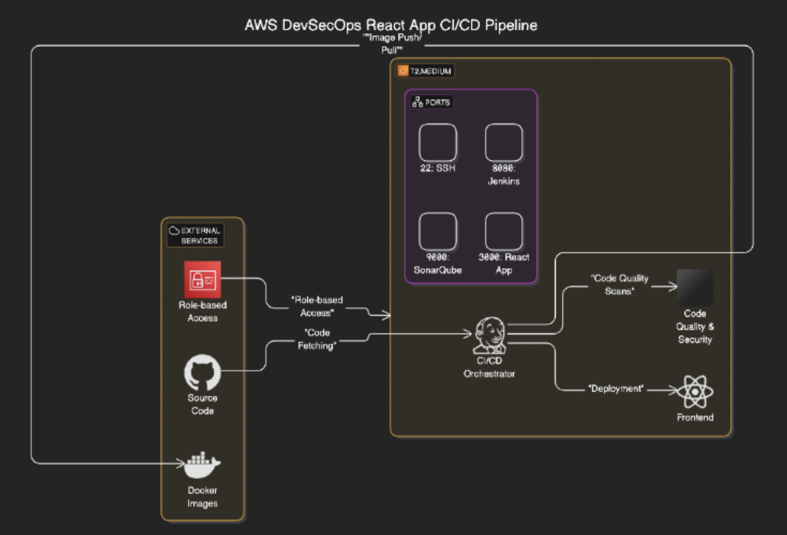

# Scalable CI/CD Pipeline for AWS DevSecOps

[](https://www.terraform.io/) [](https://www.jenkins.io/) [](https://www.docker.com/) [](https://www.sonarqube.org/) [](https://github.com/aquasecurity/trivy)

☁️ **AWS DevSecOps Homelab**  
Automated CI/CD pipeline deploying a React frontend on an EC2 instance with Terraform, Jenkins, Docker, SonarQube, Trivy, and OWASP Dependency‑Check.

---

## Table of Contents

1. [Topology](#topology)  
2. [Architecture Overview](#architecture-overview)  
3. [Prerequisites](#prerequisites)  
4. [Repository Structure](#repository-structure)  
5. [Getting Started](#getting-started)  
6. [Instance Configuration](#instance-configuration)  
7. [Jenkins Configuration & Tools](#jenkins-configuration--tools)  
8. [Pipeline Setup](#pipeline-setup)  
9. [Application Folder (`/app`)](#application-folder-app)  
10. [Cleanup](#cleanup)  
11. [Best Practices](#best-practices)  
12. [Next Steps & Enhancements](#next-steps--enhancements)  
13. [Resources](#resources)

---

## Topology

[
](https://github.com/r-ramos2/secure-ci-cd-pipeline-with-jenkins-and-terraform-for-owasp-compliance/blob/main/images/architecture-diagram.png)

Single public VPC with one EC2 host running Jenkins, Docker, SonarQube, and Trivy; protected by a dedicated Security Group.

---

## Architecture Overview

- **VPC**: Provisioned by Terraform  
- **Public Subnet**: 10.0.1.0/24  
- **Security Group**: SSH (22), HTTP (80), HTTPS (443), Jenkins (8080), SonarQube (9000), React App (3000)  
- **EC2 Instance**: Amazon Linux 2 (t2.large) running:  
  - Jenkins (systemd service)  
  - Docker Engine & containers (SonarQube)  
  - Trivy CLI  

---

## Prerequisites

- **AWS CLI** configured (`aws configure`)  
- **Terraform** >= 1.5.0  
- **Docker Hub Account**  
- **Existing EC2 Key Pair**  
- **Jenkins Admin Access**  

---

## Repository Structure

```text
.
├── app/                   # React frontend Docker context
│   ├── Dockerfile
│   ├── package.json
│   ├── package-lock.json
│   ├── public/
│   ├── src/
│   └── tailwind.config.js
├── images/                # Architecture diagrams
│   └── architecture-diagram.png
├── jenkins/               # Bootstrap scripts
│   └── install_jenkins.sh
├── terraform/             # Terraform configs
│   ├── provider.tf
│   ├── variables.tf
│   ├── main.tf
│   └── outputs.tf
├── Jenkinsfile            # Declarative pipeline
├── .gitignore
└── README.md              # This file
````

---

## Getting Started

### 1. Clone the Repo

```bash
git clone https://github.com/<your-username>/aws-ci-cd-pipeline.git
cd aws-ci-cd-pipeline/terraform
```

### 2. Configure Variables & Keypair

Terraform auto-generates an SSH keypair and uploads the public key. Review or override defaults in `variables.tf` or create `terraform.tfvars`:

```hcl
variable "region" {
  default = "us-east-1"
}

variable "ami_name_filter" {
  description = "Filter to find the latest Amazon Linux 2 AMI"
  default     = "amzn2-ami-hvm-*-gp2"
}

variable "instance_type" {
  default = "t2.large"
}

variable "my_ip" {
  description = "Your IP (CIDR) for SSH"
  default     = "203.0.113.0/32"
}
```

### 3. Bootstrap Terraform & Provision

```bash
terraform init
terraform validate
terraform plan -out=plan.tf
terraform apply plan.tf
```

Terraform will:

* Generate RSA keypair (`tls_private_key` → `aws_key_pair` → `local_file`)
* Lookup latest Amazon Linux 2 AMI via `data.aws_ami`
* Create VPC, Subnet, IGW, Route Table, Security Group
* Launch EC2 instance with user data to install Jenkins, Docker, SonarQube, and Trivy

On success, note outputs:

* `private_key_path`
* `instance_public_ip`
* `jenkins_url`
* `sonarqube_url`
* `react_app_url`

---

## Instance Configuration

SSH into the instance:

```bash
ssh -i ../terraform/${private_key_path} ec2-user@${instance_public_ip}
```

Verify services:

```bash
sudo systemctl status jenkins
docker ps         # should show SonarQube container
trivy --version
```

---

## Jenkins Configuration & Tools

1. Browse to `http://${instance_public_ip}:8080`.
2. Install plugins (Manage Jenkins → Plugin Manager):

   * Java Tool Installer
   * NodeJS
   * SonarQube Scanner
   * OWASP Dependency‑Check
   * Docker Pipeline
3. Configure global tools (Manage Jenkins → Global Tool Configuration):

   * **JDK**: `jdk17`
   * **NodeJS**: `node16`
   * **SonarQube Scanner**: `sonar-scanner`
   * **Dependency‑Check**: `DP-Check` v6.5.1
   * **Docker**: `docker`

---

## Pipeline Setup

1. Create a Pipeline job named `amazon-frontend`.
2. Add a Secret Text credential `sonar-server` with the SonarQube token.
3. Configure SonarQube server (Manage Jenkins → Configure System):

   * **Name**: `sonar-server`
   * **URL**: `http://${instance_public_ip}:9000`
   * **Server authentication token**: `sonar-server`
4. Point the job to the `Jenkinsfile` in the repo root.
5. Key stages in `Jenkinsfile`:

   * Clean Workspace
   * Checkout Code
   * SonarQube Analysis + Quality Gate
   * npm install
   * OWASP Dependency‑Check
   * Trivy FS scan
   * Docker build & push
   * Trivy image scan
   * Run App container

Trigger the build and confirm each stage succeeds.

---

## Application Folder (`/app`)

Test locally:

```bash
docker build -t amazon-frontend ./app
docker run -d -p 3000:3000 amazon-frontend
```

Visit `http://localhost:3000`.

---

## Cleanup

From the `terraform/` folder:

```bash
terraform destroy -auto-approve
```

Removes all provisioned AWS resources.

---

## Best Practices

* **Least‑Privilege IAM**: narrow policies
* **Restricted Ingress**: SSH limited to your IP
* **Secrets Management**: Jenkins Credentials
* **Remote State**: S3 backend + DynamoDB locking
* **Modular Terraform**: separate modules by function

---

## Next Steps & Enhancements

* Migrate Jenkins & app to Amazon EKS
* Add CloudWatch alerts & metrics
* Integrate Argo CD (GitOps)
* Automated Jenkins config backup
* Deploy IDS/IPS in VPC

---

## Resources

* AWS Docs: [https://aws.amazon.com/documentation/](https://aws.amazon.com/documentation/)
* Terraform: [https://www.terraform.io/docs](https://www.terraform.io/docs)
* Jenkins: [https://www.jenkins.io/doc/](https://www.jenkins.io/doc/)
* SonarQube: [https://docs.sonarqube.org/](https://docs.sonarqube.org/)
* Trivy: [https://github.com/aquasecurity/trivy](https://github.com/aquasecurity/trivy)
